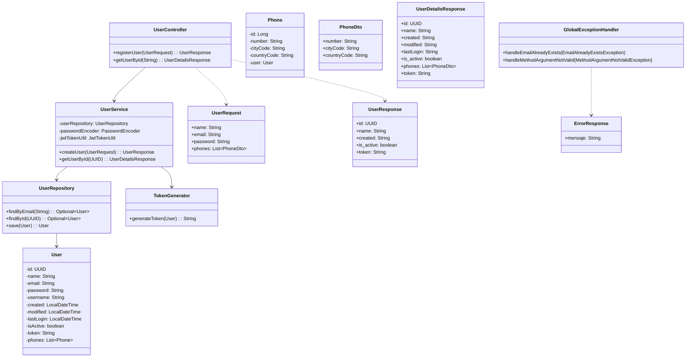

# User API

A RESTful API user register challenge for EY Consulting.

## Architecture Overview



### Script creacion BD

```sql
DROP TABLE IF EXISTS user_phones;
DROP TABLE IF EXISTS users;

-- Create users table
CREATE TABLE users (
    id UUID PRIMARY KEY,
    name VARCHAR(100) NOT NULL,
    username VARCHAR(50) NOT NULL UNIQUE,
    email VARCHAR(100) NOT NULL UNIQUE,
    password VARCHAR(255) NOT NULL,
    created TIMESTAMP NOT NULL,
    last_login TIMESTAMP,
    modified TIMESTAMP,
    is_active BOOLEAN NOT NULL,
    token VARCHAR(255)
);

-- Create user_phones table
CREATE TABLE user_phones (
    id BIGINT AUTO_INCREMENT PRIMARY KEY,
    user_id UUID NOT NULL,
    number VARCHAR(20) NOT NULL,
    citycode VARCHAR(10) NOT NULL,
    contrycode VARCHAR(10) NOT NULL,
    FOREIGN KEY (user_id) REFERENCES users(id) ON DELETE CASCADE
);
```

## API Endpoints

### Register User

```
POST /api/users
```

**Request Body:**
```json
{
  "name": "John Doe",
  "email": "john@example.com",
  "password": "Password123",
  "phones": [
    {
      "number": "1234567",
      "citycode": "1",
      "contrycode": "57"
    }
  ]
}
```

**Response (201 Created):**
```json
{
  "id": "550e8400-e29b-41d4-a716-446655440000",
  "created": "2023-04-01T12:00:00Z",
  "modified": "2023-04-01T12:00:00Z",
  "last_login": "2023-04-01T12:00:00Z",
  "token": "eyJhbGciOiJIUzI1NiIsInR5cCI6IkpXVCJ9...",
  "is_active": true
}
```

### Get User by ID

```
GET /api/users/{id}
```

**Response (200 OK):**
```json
{
  "id": "550e8400-e29b-41d4-a716-446655440000",
  "name": "John Doe",
  "email": "john@example.com",
  "created": "2023-04-01T12:00:00Z",
  "modified": "2023-04-01T12:00:00Z",
  "last_login": "2023-04-01T12:00:00Z",
  "is_active": true,
  "phones": [
    {
      "number": "1234567",
      "citycode": "1",
      "contrycode": "57"
    }
  ]
}
```

## Error Responses

### 400 Bad Request
```json
{
  "mensaje": "Validation error message"
}
```

### 404 Not Found
```json
{
  "mensaje": "User not found"
}
```

### 409 Conflict
```json
{
  "mensaje": "The email is already registered"
}
```

## Validation Rules

- **Name**: 3-100 characters, letters and spaces only
- **Email**: Valid email format
- **Password**: 
  - At least one uppercase letter
  - At least one lowercase letter
  - At least two numbers
  - Only alphanumeric characters allowed

## Setup

1. Clone the repository
2. Configure the database in `application.properties`
3. Run the application:
   ```
   ./gradlew bootRun
   ```

## Testing

Run the tests with:
```
./gradlew test
```

## Features

- User registration with email, password, and phone numbers
- JWT-based authentication
- Password encryption with BCrypt
- Input validation using Bean Validation
- Comprehensive error handling
- Unit and integration tests
- H2 in-memory database for development
- RESTful API following best practices

## Technologies Used

- Java 17
- Spring Boot 3.x
- Spring Security
- JWT Authentication
- H2 Database
- JPA/Hibernate
- JUnit 5
- Gradle