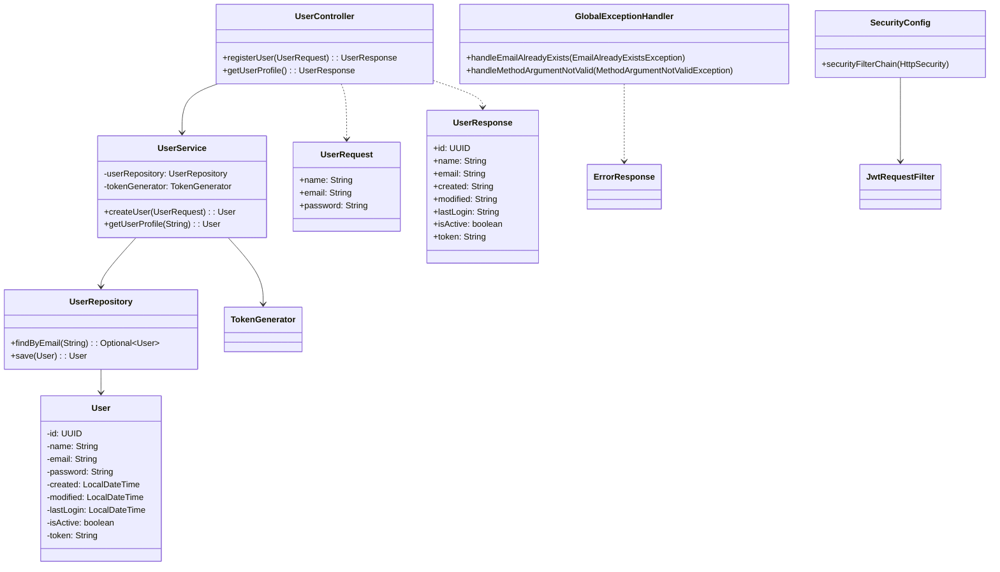

# User API

A RESTful API for user management with JWT authentication.

## Architecture Overview



## API Endpoints

### Register User
```
POST /api/users
Content-Type: application/json

{
    "name": "John Doe",
    "email": "john@example.com",
    "password": "SecurePass123"
}
```

### Get User Profile
```
GET /api/users/me
Authorization: Bearer <token>
```

## Validation Rules

- **Name**: 3-100 characters, letters and spaces only
- **Email**: Valid email format
- **Password**: 
  - At least one uppercase letter
  - At least one lowercase letter
  - At least two numbers
  - Only alphanumeric characters allowed

## Setup

1. Clone the repository
2. Configure the database in `application.properties`
3. Run the application:
   ```
   ./gradlew bootRun
   ```

## Testing

Run the tests with:
```
./gradlew test
```

## Technologies Used

- Java 17
- Spring Boot 3.x
- Spring Security
- JWT Authentication
- H2 Database (for development)
- JPA/Hibernate
- JUnit 5
- Maven/Gradle